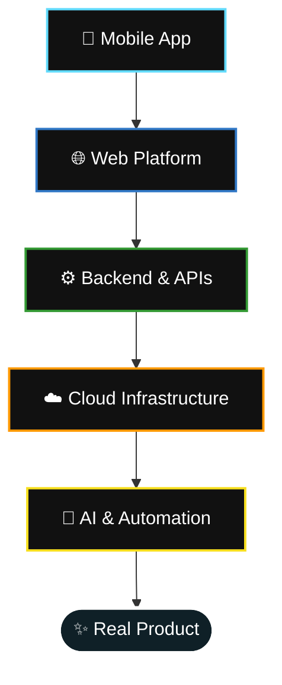

<div align="center">


<br/>


<br/><br/>

[](https://www.parmeetsingh.ca)
[](https://linkedin.com/in/bangaparmeet)
[](https://instagram.com/banga.parmeet)
[](https://youtube.com/@ParmeetSinghBanga)
[](mailto:bangaparmeet.ca@gmail.com)

<br/>

> **I build products from the first idea to the moment they reach real users.**

</div>

---

## `whoami`

I'm a **Full Stack Developer** with experience building across the entire product stack — from polished mobile experiences and modern web applications to backend systems, cloud infrastructure, and AI-powered features.

I enjoy working where **technology meets product thinking**.

That means I don't just like building features. I like taking an idea, figuring out how it should work, designing the experience, building the system behind it, integrating intelligence where it makes sense, and shipping it.

<div align="center">



</div>

<br/>

## `/now`

<table>
<tr>
<td width="100%">

### 🚀 Currently building **Vona**

Exploring the next generation of intelligent product experiences through a combination of:

| | |
|---|---|
| 🤖 | AI-powered workflows |
| ⚡ | Intelligent automation |
| 📱 | Mobile-first experiences |
| 🧠 | Agent-driven systems |
| ✨ | Interfaces that make complex things feel simple |

**Current mindset:**
> Build useful things. Ship them. Learn from real users. Improve. Repeat.

</td>
</tr>
</table>

<br/>

## `products`

<table>
<tr>
<td width="50%" valign="top">

### 🚗 AutoLog
A product built around the automotive experience.

`Mobile Experience` `Product Design` `Full Stack`

</td>
<td width="50%" valign="top">

### 📄 ResumeRail
An AI-powered platform designed to help users create better resumes with modern tools and intelligent assistance.

`AI` `Web` `Backend` `Product Development`

</td>
</tr>
<tr>
<td width="50%" valign="top">

### 🎱 Tambola Number Caller
A digital experience for running and managing Tambola games.

`Mobile` `Real-Time Experiences` `UX`

</td>
<td width="50%" valign="top">

### 🎬 ASK Studios
Building digital experiences and products under the ASK Studios ecosystem.

`Web` `Product` `Creative Technology`

</td>
</tr>
<tr>
<td width="50%" valign="top">

### 🎒 Before You Go
A product designed around helping users remember and prepare for the things that matter before heading out.

`Mobile` `Notifications` `Product Design`

</td>
<td width="50%" valign="top">

</td>
</tr>
</table>

<br/>

## `stack`

Instead of listing every technology I've ever touched, these are the tools I actively build with.

**Core Development**

<p>


</p>

**Mobile**

<p>


</p>

**Backend & Cloud**

<p>


</p>

**AI & Intelligent Systems**

<p>


</p>

<br/>

## `what_i_do`

<table>
<tr>
<td width="50%" valign="top">

### 📱 Mobile Development
Building cross-platform mobile applications for iOS and Android with React Native and Expo.

From concept to App Store and Play Store.

</td>
<td width="50%" valign="top">

### 🌐 Web Development
Modern, responsive web applications with React, TypeScript, Node.js and cloud infrastructure.

</td>
</tr>
<tr>
<td width="50%" valign="top">

### ⚙️ Backend Development
APIs, authentication, databases, real-time systems, cloud services and scalable application architecture.

</td>
<td width="50%" valign="top">

### 🤖 AI Integration
Bringing AI into real products through APIs, agents, automation and intelligent workflows.

</td>
</tr>
</table>

<br/>

## `philosophy`

```javascript
const build = {
  start: "with an idea",
  focus: "on the problem",
  design: "for real people",
  develop: "end to end",
  ship: "something useful",
  improve: "continuously"
};
```

I believe the best developers understand more than just code.

They understand:

- Why a product should exist
- Who it's being built for
- What makes the experience better
- How the system works behind the scenes
- When AI actually adds value
- And most importantly — how to ship

<br/>

## `currently_exploring`

<p align="center">


<br/>


</p>

AI is becoming part of how modern software is built, but I'm especially interested in what happens when it becomes part of the **product itself**.

Not AI for the sake of AI.

**AI that removes friction. AI that automates useful work. AI that makes software feel more intelligent.**

<br/>

## `github`

<div align="center">


<br/>


</div>

<br/>

## `connect`

<div align="center">

### Have an interesting idea?

**Interesting Products · AI Applications · Mobile Apps · Web Platforms · Automation**

<br/>

[](https://www.parmeetsingh.ca)
[](https://linkedin.com/in/bangaparmeet)
[](https://instagram.com/banga.parmeet)
[](https://youtube.com/@ParmeetSinghBanga)
[](mailto:bangaparmeet.ca@gmail.com)

</div>


<div align="center">

### `code → create → launch`
**Building one idea at a time.**

</div>
